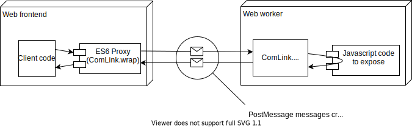
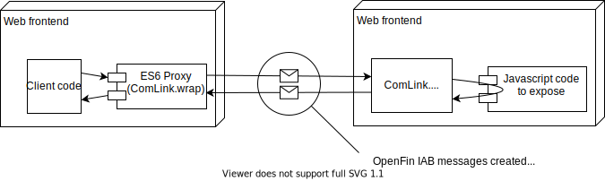

# comlink-openfin

ComLink (https://github.com/GoogleChromeLabs/comlink) is a great way to simplify interacting with web workers or iFrames that otherwise require managing messages via [postMessage](https://developer.mozilla.org/en-US/docs/Web/API/Worker/postMessage). Using ComLink, a [Proxy](https://developer.mozilla.org/en-US/docs/Web/JavaScript/Reference/Global_Objects/Proxy) is created on one side of a [MessageChannel](https://developer.mozilla.org/en-US/docs/Web/API/MessageChannel) that can interact with an API on the other end of the channel as if it were a local, asynchronous API.



[OpenFin](https://openfin.co/) builds on [Electron](https://www.electronjs.org/) and provides its own messaging channel (the Inter-Application Bus or IAB) that works between (and within) OpenFin applications allowing for cross-application integration and communication. It's a powerful mechanism with the same problems as web workers: the need to manage transceiving messages between the applications.

As ComLink already provides a simple mechanism for exposing an API over a message channel, this package adds a ComLink-compatible endpoint to do the same message transceiving via the OpenFin IAB. Using the comlink-openfin endpoint makes integrating different OpenFin applications easier by making an API available in one application directly accessible from a different application.



Using the endpoint requires using the single exported function to construct it:

```
openfinEndpoint(topic: string, remote?: fin.Identity): Comlink.Endpoint
```

- `topic`: The IAB topic name to send/receive messages using - this should be unique and follow OpenFin guidelines
- `remote`: An optional OpenFin application uuid for the other end (sender or receiver) to enforce direct sender/receiver communication. If not specified, messages are broadcast to all topic listeners and received from any application on the same topic.

## The exposed API

Here we expose an API from one OpenFin application. Comlink and the comlink-openfin endpoint will handle the IAB messages as well as calling the API and returning any responses.

```
import * as Comlink from "comlink";
import { openfinEndpoint } from "comlink-openfin";

const api: Api = {
  callMe: (a: string): string => `Received "${a}"`;
};

Comlink.expose(api, openfinEndpoint("Topic name"));
// If this was in a web worker, the call would be:
//   Comlink.expose(api);
```

## The API client

This snippet, in a separate OpenFin application from above, creates the local proxy that will provide access to the other application's API. The common topic name allows the two applications (running on the same desktop) to communicate. As a result, the call to callMe (changed to async by ComLink) will automatically send a message from this application to the other application over the IAB and await the response, also returned via the IAB. The result is code like below - remote.callMe is called in this application but run in the other application.

```
import * as Comlink from "comlink";
import { openfinEndpoint } from "comlink-openfin";

const remote = Comlink.wrap<Api>(openfinEndpoint("Topic name"));
// If the above was to call a web worker, the code would be:
//   const worker = new Worker("worker.js");
//   const remote = Comlink.wrap<Api>(worker);

const response = await remote.callMe("My message");
```

## Caveats

Comlink is designed for a single sender/receiver pair. Although specifying an OpenFin identity for the sender/receiver is optional, subscribing more than one sender/receiver using the same recipient is unlikely to work well (and will probably result in an infinite loop of malformed messages going back and forth between sender and receiver).
